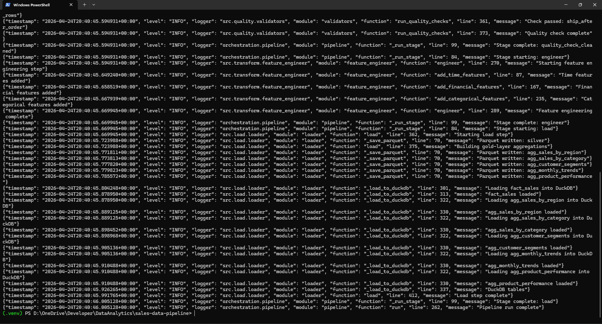
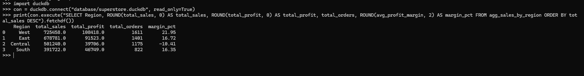

# 🛢️ Superstore Sales Data Pipeline

## ⚡ Quick Summary
This project builds a production-style sales data pipeline that transforms raw CSV data into clean, analytics-ready datasets using a layered (Bronze → Silver → Gold) architecture. 

It automates data cleaning, validation, feature engineering, and aggregation, and stores results in both Parquet and DuckDB for fast analytical querying.

### End-to-End ETL Pipeline with Medallion Architecture, DuckDB & GitHub Actions CI/CD

---

## 🏷️ Project Badges

[](https://www.python.org/)
[](https://pandas.pydata.org/)
[](https://duckdb.org/)
[](https://www.docker.com/)
[](https://github.com/features/actions)
[](https://codecov.io/gh/deepan-mehta-analytics/sales-data-pipeline)
[](https://github.com/deepan-mehta-analytics/sales-data-pipeline/releases/tag/v1.0.0)
[](https://github.com/deepan-mehta-analytics/sales-data-pipeline/releases)

---

## 📌 Project Overview
This project implements a **production-grade end to end ETL pipeline** that transforms raw sales data into validated, analytics-ready datasets using a modern layered architecture.

it uses the [Kaggle Superstore Sales Dataset](https://www.kaggle.com/datasets/vivek468/superstore-dataset-final), demonstrating core Data Engineering patterns used in modern data platforms.

It implements:

- **Medallion Architecture** — Bronze → Silver → Gold layered data quality model
- **Automated data quality gates** — 6 checks run before and after every transformation
- **Feature engineering** — 13 derived analytical columns (margins, shipping days, profit tiers)
- **DuckDB analytical store** — Zero-infrastructure OLAP engine with full SQL support
- **CI/CD via GitHub Actions** — Lint, test, coverage, and Codecov upload on every push; scheduled daily runs
- **Docker support** — Multi-stage containerised pipeline execution
- **Data profiling** *(v1.1)* — HTML profiling report via ydata-profiling generated after each run
- **Drift detection** *(v1.1)* — Statistical drift check comparing key metrics against prior-run reference

---

## ⚙️ Tech Stack

| Layer | Tool | Purpose |
|---|---|---|
| Language | Python 3.11 | Pipeline implementation |
| Data Processing | pandas 2.x + NumPy | DataFrame operations and vectorised transforms |
| Storage Format | Apache Parquet (pyarrow) | Columnar binary storage for Silver and Gold layers |
| Analytical DB | DuckDB | Embedded OLAP engine for SQL querying |
| Config | PyYAML | Schema and pipeline configuration |
| Testing | pytest + pytest-cov | Unit and integration test suite |
| Coverage | Codecov | Coverage tracking and badge via codecov.io |
| Data Profiling | ydata-profiling | Interactive HTML profiling report (optional, v1.1) |
| Code Quality | black + isort + flake8 | Formatting, import sorting, and linting |
| CI/CD | GitHub Actions | Automated test and pipeline execution |
| Containers | Docker + Compose | Reproducible execution environment |

---

## 🎯 Business Problem

Retail organisations accumulate transactional sales data that is too large and messy for manual analysis, yet too small to justify a cloud data warehouse.

> **How can we build a reliable, automated pipeline that transforms raw sales data into clean, queryable analytical tables — with data quality guarantees and zero manual intervention?**

---

## 🏗️ Pipeline Architecture

```
[Bronze CSV]  ──►  [Extract]  ──►  [Quality Check]  ──►  [Clean]
     ──►  [Quality Check]  ──►  [Feature Engineer]  ──►  [Load]
          ──►  [Silver Parquet]  +  [Gold Parquets]  +  [DuckDB]
```

| Layer | Location | Format | Description |
|---|---|---|---|
| 🟤 Bronze | `data/bronze/` | CSV | Raw, immutable source file from Kaggle |
| ⚪ Silver | `data/silver/` | Parquet | Cleaned + 13 derived feature columns |
| 🟡 Gold | `data/gold/` | Parquet | 5 business-ready aggregation tables |
| 🔵 Analytical | `database/` | DuckDB | SQL-queryable OLAP database |

---

## 📁 Repository Structure

```
sales-data-pipeline/
│
├── README.md
│
├── .github/
│   └── workflows/
│       ├── ci.yml                  ← Lint + test on every push/PR
│       └── pipeline.yml            ← Scheduled daily pipeline run
│
├── config/
│   ├── config.yaml                 ← Paths, encoding, quality thresholds
│   └── schema.yaml                 ← Column types, nullability, allowed values
│
├── data/
│   ├── bronze/                     ← Place Kaggle CSV here
│   ├── silver/                     ← Cleaned Parquet (pipeline output)
│   └── gold/                       ← Aggregation Parquets (pipeline output)
│       ├── sales_by_region.parquet
│       ├── sales_by_category.parquet
│       ├── customer_segments.parquet
│       ├── monthly_trends.parquet
│       └── product_performance.parquet
│
├── database/
│   └── superstore.duckdb           ← OLAP database (pipeline output)
│
├── docs/
│   ├── architecture.md             ← DAG diagram + design decisions
│   └── data_dictionary.md          ← All 34 columns documented
│
├── logs/
│   └── pipeline.log                ← JSON-structured run log
│
├── notebooks/
│   └── eda.ipynb                   ← Exploratory data analysis
│
├── orchestration/
│   └── pipeline.py                 ← DAG-style orchestrator
│
├── src/
│   ├── extract/
│   │   └── extractor.py            ← Bronze: CSV ingestion + schema validation
│   ├── transform/
│   │   ├── cleaner.py              ← Silver: cleaning + type normalisation
│   │   └── feature_engineer.py    ← Silver: 13 derived analytical columns
│   ├── load/
│   │   └── loader.py              ← Gold: Parquet export + DuckDB load
│   ├── quality/
│   │   ├── validators.py          ← 6 automated data quality checks
│   │   ├── profiler.py            ← v1.1: HTML data-profiling report generator
│   │   └── drift_detector.py     ← v1.1: Statistical drift detection vs prior run
│   └── utils/
│       └── logger.py              ← Centralised JSON-structured logger
│
├── reports/                        ← Generated profiling HTML reports (gitignored)
│
├── tests/
│   ├── conftest.py                 ← Shared pytest fixtures
│   ├── unit/                       ← Fast, isolated unit tests (90 cases)
│   └── integration/                ← Full end-to-end pipeline test
│
├── Dockerfile                      ← Multi-stage container build
├── docker-compose.yml              ← Local containerised execution
├── Makefile                        ← Developer convenience commands
├── pyproject.toml                  ← Packaging + tool configuration
├── requirements.txt                ← Production dependencies
├── requirements-dev.txt            ← Testing + linting dependencies
└── requirements-profiling.txt      ← v1.1: Optional ydata-profiling dependency
```

---

## ▶️ How to Run

### 📌 Option 1 — Local (Recommended for development)

#### 1. Clone the repository

```bash
git clone https://github.com/deepan-mehta-analytics/sales-data-pipeline.git
cd sales-data-pipeline
```

#### 2. Create and activate a virtual environment

```bash
# Windows
python -m venv .venv
.venv\Scripts\activate

# macOS / Linux
python -m venv .venv
source .venv/bin/activate
```

#### 3. Install dependencies

```bash
make install
# or manually:
pip install -r requirements.txt
pip install -r requirements-dev.txt
```

#### 4. Download the dataset from Kaggle

Download [Sample - Superstore.csv](https://www.kaggle.com/datasets/vivek468/superstore-dataset-final) and rename/place it at:

```
data/bronze/sales_data.csv
```

#### 5. Run the pipeline

```bash
make run
# or:
python orchestration/pipeline.py
```

#### 6. Query the results

```python
import duckdb

con = duckdb.connect("database/superstore.duckdb")

# Top regions by profit
con.execute("""
    SELECT Region, ROUND(total_profit, 2) AS profit
    FROM   agg_sales_by_region
    ORDER  BY total_profit DESC
""").fetchdf()
```

---

### 🐳 Option 2 — Docker

#### 1. Place the dataset

```
data/bronze/sales_data.csv
```

#### 2. Build and run

```bash
docker compose up --build
```

Pipeline outputs are volume-mounted to your local `data/`, `database/`, and `logs/` directories and persist after the container exits.

#### 3. Run tests inside the container

```bash
docker compose run pipeline make test
```

---

### ☁️ Option 3 — GitHub Actions (CI/CD)

The pipeline runs automatically on a **daily schedule** via `.github/workflows/pipeline.yml`.

To trigger it manually:

1. Go to your repository on GitHub
2. Click **Actions** → **Pipeline — Daily ETL Run**
3. Click **Run workflow**

Gold Parquet outputs and the pipeline log are uploaded as **build artefacts** after each successful run.

---

## 🧪 Running Tests

```bash
# All tests with coverage report
make test

# Unit tests only (fast — no I/O)
make test-unit

# Integration tests only (full pipeline run)
make test-int
```

---

## 🔍 Code Quality

```bash
# Check formatting and linting without modifying files
make lint

# Auto-format all code
make format
```

Pre-commit hooks run black, isort, and flake8 automatically before every commit after `make install`.

Code coverage is tracked via [Codecov](https://codecov.io/gh/deepan-mehta-analytics/sales-data-pipeline). To enable the coverage badge, add a `CODECOV_TOKEN` secret to the repository (**Settings → Secrets → Actions → New repository secret**) using the token from your Codecov project settings.

---

## 📈 Data Profiling & Observability *(v1.1)*

The pipeline includes two observability features that activate automatically after each successful run.

### HTML Profiling Report

A comprehensive data-profiling report is generated by `src/quality/profiler.py` after the load step:

```bash
# Install the profiling dependency (once)
pip install -r requirements-profiling.txt

# Run the pipeline — the report is written to reports/
make run
# → reports/profile_YYYYMMDD_HHMMSS.html
```

The report surfaces column statistics, distribution histograms, correlation matrices, and missing-value patterns in a self-contained HTML file. In CI/CD, the report is uploaded as a named build artefact after each daily pipeline run.

> If `ydata-profiling` is not installed the profiler falls back to a lightweight `pandas.describe()` HTML page — the pipeline never fails due to a missing profiling dependency.

### Statistical Drift Detection

`src/quality/drift_detector.py` compares the current run's key metrics against a JSON reference snapshot saved by the previous run:

| Metric tracked | Drift signal |
|---|---|
| `row_count` | Unexpected row count change vs last run |
| `Sales_mean / Sales_std` | Revenue distribution shift |
| `Profit_mean / Profit_std` | Profitability distribution shift |
| `Discount_mean` | Discount policy change signal |
| `unique_customers` | Customer base growth or shrinkage |
| `unique_products` | Catalogue change detection |

Any metric whose relative change exceeds the configured threshold (default **5 %**) emits a `WARNING` log. Drift is surfaced as an observability signal — it never fails the pipeline.

```bash
# Threshold is configurable in config.yaml
pipeline:
  drift_threshold: 0.05   # 5 % relative change triggers a WARNING
```

---

## 🧪 Pipeline Execution Evidence

The pipeline runs end-to-end in under **1 second** on the full 9,994-row Superstore dataset, with structured JSON logs emitted at every stage for observability.



**Run summary:**

| Stage | Outcome |
|---|---|
| Extract | CSV ingested, schema validated |
| Quality check (raw) | 5/5 checks passed |
| Clean | Dates parsed, whitespace stripped, categoricals normalised, duplicates removed |
| Quality check (cleaned) | 6/6 checks passed (incl. `ship_after_order`) |
| Feature engineer | 13 derived columns added (time, financial, categorical) |
| Load | Silver + 5 Gold Parquets written, DuckDB populated |
| Drift detection *(v1.1)* | Key metrics compared against prior-run reference; 0 findings on stable dataset |
| Profiling *(v1.1)* | HTML report written to `reports/` |
| **Total runtime** | **~617 ms** |

Every pipeline run is logged as structured JSON to `logs/pipeline.log` for downstream ingestion into any observability platform (Elastic, Datadog, CloudWatch, Splunk).

---

## 📊 Gold Layer Tables — Live Query Results

The pipeline loads all five Gold aggregation tables into an embedded DuckDB analytical store that can be queried with standard SQL. Here is a live query result against the real Superstore dataset (9,994 rows):

```sql
SELECT Region,
       ROUND(total_sales,  0) AS total_sales,
       ROUND(total_profit, 0) AS total_profit,
       total_orders,
       ROUND(avg_profit_margin, 2) AS margin_pct
FROM   agg_sales_by_region
ORDER  BY total_sales DESC;
```



**Key insight surfaced by the pipeline:** The **Central region is operating at a net loss** (-10.41% margin) despite generating $501K in revenue — a business problem worth investigating. **West region** leads both revenue and profitability at a healthy 21.95% margin.

### Full Gold Layer Schema

| Table | Rows | Key Metrics |
|---|---|---|
| `agg_sales_by_region` | 4 | total_sales, total_profit, avg_profit_margin |
| `agg_sales_by_category` | 17 | total_sales, total_profit, avg_discount |
| `agg_customer_segments` | 3 | total_customers, avg_order_value |
| `agg_monthly_trends` | 48 | total_sales, total_orders (monthly time series) |
| `agg_product_performance` | 1,850 | total_sales, total_profit per SKU |
---

## 🔜 Roadmap

| Version | Theme | Status |
|---|---|---|
| **v1.0.0** | MVP — full medallion ETL, DuckDB, CI/CD, Docker, 90 tests | ✅ Released |
| **v1.1** | Observability — Codecov, ydata-profiling HTML report, drift detection | 🔄 In Development |
| **v1.2** | Query API — FastAPI layer exposing DuckDB gold tables as REST endpoints | 📋 Planned |
| **v2.0** | Cloud-Native — S3/GCS output, Airflow/Prefect DAG, BigQuery store | 📋 Backlog |

See [PROJECT-STATUS.md](PROJECT-STATUS.md) for full roadmap detail.

---

## 📂 Dataset

**Source:** [Kaggle — Superstore Dataset (vivek468)](https://www.kaggle.com/datasets/vivek468/superstore-dataset-final)

- 9,994 order line items · 21 base columns · 13 derived feature columns
- Date range: January 2014 – December 2017
- 793 unique customers · 1,850 unique products
- Categories: Furniture, Office Supplies, Technology
- US Regions: East, West, Central, South

---

## 👤 Author

**Deepan Mehta**

- Data Analytics → Data Engineering → AI/ML Engineering
- Focused on building end-to-end data systems combining analytics, automation, and deployment
- Experience in ETL pipelines, predictive modelling, and analytical databases

🔗 GitHub: [deepan-mehta-analytics](https://github.com/deepan-mehta-analytics)
